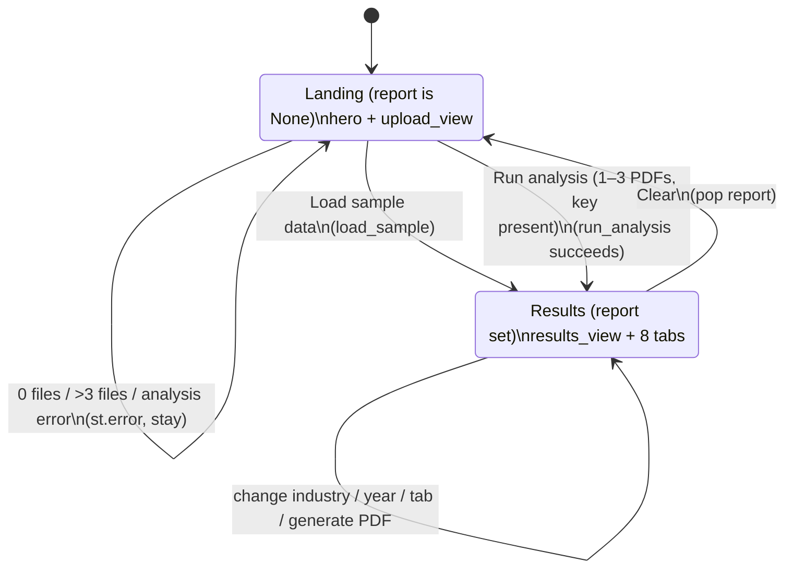

# AuditIQ — Functional Specification

| | |
|---|---|
| **Product** | AuditIQ — AI-Powered Forensic Audit Intelligence |
| **Version** | Draft v0.1 |
| **Status** | Draft |
| **Date** | 2026-06-25 |
| **Audience** | Engineers, QA, analysts |
| **Related docs** | [README](./README.md) · [PRD](./PRD.md) · [TECH_ARCHITECTURE](./TECH_ARCHITECTURE.md) · [CODE_MAP](./CODE_MAP.md) · [TEST_PLAN](./TEST_PLAN.md) |

---

## 0. About this document

This is the detailed functional specification for AuditIQ. For each feature it states
**inputs**, **processing logic** (with exact formulas, coefficients, and thresholds),
**outputs**, **UI behaviour**, **edge cases**, and **error states**. It is grounded in the
source as of 2026-06-25; where the running code differs from product narrative or from the
prototype, the difference is called out explicitly (consolidated in [§15](#15-known-discrepancies--notes)).

Conventions used throughout:

- **Monetary units:** all financial figures are in **millions** of the reporting currency.
- **Risk levels:** `low` / `medium` / `high` (`config.RISK_LEVELS`).
- **Flags:** `ok` / `medium` / `high` (`models.Flag`).
- For the file-by-file API reference, see [CODE_MAP.md](./CODE_MAP.md); for diagrams and the
  layering rationale, see [TECH_ARCHITECTURE.md](./TECH_ARCHITECTURE.md).

Feature index:

1. [PDF upload & text extraction](#1-pdf-upload--text-extraction)
2. [AI structured extraction](#2-ai-structured-extraction)
3. [The `FinancialStatement` data dictionary](#3-the-financialstatement-data-dictionary)
4. [Beneish M-Score](#4-beneish-m-score)
5. [Benford's Law](#5-benfords-law)
6. [Altman Z-Score](#6-altman-z-score)
7. [Financial ratios](#7-financial-ratios)
8. [Industry benchmarking](#8-industry-benchmarking)
9. [Findings synthesis & overall risk](#9-findings-synthesis--overall-risk)
10. [Multi-year comparison](#10-multi-year-comparison)
11. [News sentiment](#11-news-sentiment)
12. [AI narrative summary](#12-ai-narrative-summary)
13. [PDF report](#13-pdf-report)
14. [Dashboard (Streamlit UI)](#14-dashboard-streamlit-ui)
15. [Configuration, currency, number & locale handling](#15-known-discrepancies--notes)

---

## 1. PDF upload & text extraction

**Module:** `auditiq/extraction/pdf_reader.py`. **Capability:** FR-1.

### Inputs
- One to three PDF files supplied via the Streamlit uploader (`upload_view`, `accept_multiple_files=True`, `type="pdf"`). The uploader hands the app raw **bytes** (`f.getvalue()`), which go to `read_pdf_bytes`. A path-based entry point `read_pdf(path)` also exists (not used by the UI today).
- Optional `max_pages` override; defaults to `settings.max_pdf_pages` (env `AUDITIQ_MAX_PDF_PAGES`, default **60**).

### Processing logic
1. Open the PDF with `pdfplumber` (`pdfplumber.open(...)`).
2. `_read(pdf, max_pages)` records `total = len(pdf.pages)` (the true page count), then iterates **only the first `max_pages` pages** (`pdf.pages[:max_pages]`):
   - `page.extract_text() or ""` is appended to `page_texts`.
   - `page.extract_tables() or []` is extended into `tables`.
3. Builds a `PdfContent` dataclass:
   - `full_text` = all captured page texts joined with `"\n"`.
   - `page_texts` = per-page list.
   - `tables` = list of extracted tables.
   - `num_pages` = `total` (note: the *original* count, even if more pages exist than were scanned).

### Statement-page heuristic — `PdfContent.financial_text`
A property that returns text from likely financial-statement pages only:
- For each page text, keep it if its lowercase form contains any of `_STATEMENT_KEYWORDS`:
  `"balance sheet"`, `"statement of financial position"`, `"income statement"`,
  `"statement of profit"`, `"statement of operations"`, `"cash flow"`,
  `"consolidated statement"`.
- Matching pages are joined with `"\n"`.
- **Fallback:** if no page matches, returns the entire `full_text`.

Rationale: `financial_text` focuses the AI extractor and reduces token cost; `full_text` (the whole document) is what feeds Benford to maximise sample size.

### Outputs
A `PdfContent` with `full_text`, `page_texts`, `tables`, `num_pages`, and the derived `financial_text`. In `run_analysis`: `content.financial_text` → AI extractor; `content.full_text` → Benford text keyed by year.

### UI behaviour
- During analysis the status panel prints `📄 Reading **{filename}**` per file and `🤖 Extracting financials with Claude ({num_pages} pages)…`.

### Edge cases
- **Page cap:** PDFs longer than `max_pages` are silently truncated to the first `max_pages` pages for text/tables, but `num_pages` still reports the full count (so the UI may show "180 pages" while only 60 were scanned).
- **Image-only / scanned PDFs:** `extract_text()` returns empty strings; `full_text`/`financial_text` will be empty or sparse. No OCR is performed (out of scope per PRD §9). Extraction quality degrades or the LLM returns mostly `null`s.
- **No statement keywords found:** `financial_text` gracefully falls back to `full_text`.
- **Tables** are extracted but not currently consumed by downstream analysis (captured for future use).

### Error states
- A corrupt/unreadable PDF raises from `pdfplumber.open`; in the UI this propagates up to `run_analysis` and is caught by `upload_view`'s `try/except`, surfaced as `Analysis failed: {exc}` without clearing session state.
- This step has **no AI dependency** and works with no API key (though the UI only invokes it inside the key-gated upload flow).

---

## 2. AI structured extraction

**Module:** `auditiq/extraction/ai_extractor.py` (+ `intelligence/llm.py`). **Capability:** FR-2.

### Inputs
- `text` — typically `PdfContent.financial_text`.
- `year_label` — derived by `app._guess_year(filename)`: first `20\d{2}` match in the filename, else the filename stem truncated to 12 characters.
- Optional `model` — defaults to `settings.extraction_model` (`claude-sonnet-4-6`).
- **Requires** `ANTHROPIC_API_KEY`.

### Processing logic
1. `_prompt(text, year_label)` builds a schema-constrained prompt:
   - Persona: "expert forensic financial analyst".
   - Instruction: *return ONLY valid JSON — no markdown, no backticks, no commentary*; use `null` for unknown values; all monetary values in **millions**, in the report's reporting currency; **negative numbers for losses/outflows**.
   - The `year` field is pinned to `year_label`; `industry` is constrained to `retail|technology|manufacturing|financial|healthcare|energy` (`_INDUSTRIES`); `currency` to `GBP|USD|EUR|...`.
   - Guidance lines define `ebit` (operating profit before interest and tax), `totalDebt` (interest-bearing borrowings, short+long term) vs `totalLiabilities` (all liabilities), `marketValueEquity` (only if a market cap is stated, else null), `redFlags` (concrete textual warning signs: going-concern doubt, restatements, auditor qualifications, related-party transactions, accounting-policy changes, large one-off items), and `notes`.
   - **Input is truncated to the first 15,000 characters** (`text[:15000]`).
2. `complete(prompt, model=…, max_tokens=1500)` issues a single-turn `messages.create` (temperature 0.0) and returns only the assembled `text` content blocks.
3. `extract_json(raw)` parses tolerantly (see [§2 JSON parsing](#json-parsing-llmextract_json)).
4. If the parsed value is not a `dict`, raise `ValueError("Extraction did not return a JSON object.")`.
5. `data.setdefault("year", year_label)` ensures a year is present.
6. `FinancialStatement.model_validate(data)` validates and coerces (camelCase aliases accepted; unknown keys ignored via `extra="ignore"`).

#### The extraction JSON schema (camelCase, as sent to Claude)
```
{
  "companyName": string,
  "year": "<year_label>",
  "industry": "retail|technology|manufacturing|financial|healthcare|energy",
  "currency": "GBP|USD|EUR|...",
  "revenue": number, "cogs": number, "grossProfit": number, "ebit": number,
  "netIncome": number, "sga": number, "depreciation": number, "interestExpense": number,
  "operatingCashFlow": number,
  "totalAssets": number, "currentAssets": number, "ppe": number,
  "receivables": number, "inventory": number, "cash": number,
  "currentLiabilities": number, "totalLiabilities": number, "totalDebt": number,
  "equity": number, "retainedEarnings": number, "marketValueEquity": number,
  "redFlags": [string, ...],
  "notes": string
}
```

### JSON parsing — `llm.extract_json`
Robust to model formatting quirks:
1. Strip ```` ```json ```` / ```` ``` ```` fences and surrounding backticks/whitespace.
2. `json.loads(cleaned)`.
3. On `JSONDecodeError`, regex-search for the first `{...}` or `[...]` block (`re.DOTALL`) and parse that; if none, re-raise.

### Outputs
A validated `FinancialStatement` for one year. In `run_analysis`, the `full_text` for that PDF is stored in `benford_texts[fs.year or yr]`.

### UI behaviour
- One extraction call **per uploaded PDF**, inside the `st.status` progress panel.

### Edge cases
- Missing figures → `null` → `None` on the model (all monetary fields are `Optional`).
- Loss/outflow values are expected as negatives (prompt-instructed); downstream engines treat negatives correctly (e.g. negative net income, negative operating cash flow → high accruals).
- The 15k-char truncation can drop later statements in very large reports → some fields unpopulated.
- `industry` from extraction is informational on the statement; the **benchmarking and Altman model selection use the industry chosen in the sidebar**, passed through the pipeline (extraction's `industry` value influences Altman only when `compute_altman` is called directly on a statement, not via the dashboard — see [§6](#6-altman-z-score)).

### Error states
- No API key → `get_client()` raises `LLMError`; this surfaces in the upload flow as `Analysis failed: …` (the Run-analysis button is normally disabled without a key, so this path is reached only if the key disappears mid-session).
- Non-object JSON → `ValueError`. Any SDK/network error from `complete` propagates and is caught by `upload_view`.

---

## 3. The `FinancialStatement` data dictionary

**Module:** `auditiq/models.py`. **Config:** `model_config = ConfigDict(populate_by_name=True, extra="ignore")` — so models validate from either snake_case attribute names or the camelCase JSON aliases, and unknown keys are dropped.

All monetary fields are `Optional[float]` and expressed in **millions** of the reporting currency. Sign convention: losses/outflows negative.

| Python attribute | JSON alias | Group | Meaning / notes |
|---|---|---|---|
| `company_name` | `companyName` | Identity | Company name (string). |
| `year` | `year` | Identity | Reporting year label (string). |
| `industry` | `industry` | Identity | Sector tag from extraction. |
| `currency` | `currency` | Identity | ISO-like currency code (e.g. `GBP`). **Captured but not used for rendering** — see [§15](#1510-currency-number--locale-handling-as-built). |
| `revenue` | `revenue` | Income statement | Total revenue / turnover. |
| `cogs` | `cogs` | Income statement | Cost of goods sold. |
| `gross_profit` | `grossProfit` | Income statement | Gross profit (see derived `resolved_gross_profit`). |
| `ebit` | `ebit` | Income statement | Operating profit before interest & tax. |
| `net_income` | `netIncome` | Income statement | Net income / profit after tax. |
| `sga` | `sga` | Income statement | Selling, general & administrative expense. |
| `depreciation` | `depreciation` | Income statement | Depreciation (and amortisation) expense. |
| `interest_expense` | `interestExpense` | Income statement | Interest expense. |
| `operating_cash_flow` | `operatingCashFlow` | Cash flow | Net cash from operating activities. |
| `total_assets` | `totalAssets` | Balance sheet | Total assets. |
| `current_assets` | `currentAssets` | Balance sheet | Current assets. |
| `ppe` | `ppe` | Balance sheet | Property, plant & equipment (net). |
| `receivables` | `receivables` | Balance sheet | Trade/other receivables. |
| `inventory` | `inventory` | Balance sheet | Inventory / stock. |
| `cash` | `cash` | Balance sheet | Cash & equivalents. |
| `current_liabilities` | `currentLiabilities` | Balance sheet | Current liabilities. |
| `total_liabilities` | `totalLiabilities` | Balance sheet | All liabilities. |
| `total_debt` | `totalDebt` | Balance sheet | Interest-bearing borrowings (short + long term). |
| `equity` | `equity` | Balance sheet | Book shareholders' equity. |
| `retained_earnings` | `retainedEarnings` | Balance sheet | Retained earnings. |
| `market_value_equity` | `marketValueEquity` | Balance sheet | Market capitalisation, if stated (else `None`). |
| `red_flags` | `redFlags` | Qualitative | List of textual warning signs; defaults to `[]`. |
| `notes` | `notes` | Qualitative | Free-text commentary. |

### Derived properties
| Property | Logic | Returns `None` when |
|---|---|---|
| `working_capital` | `current_assets − current_liabilities` | either input is `None`. |
| `resolved_total_liabilities` | `total_liabilities` if present; else `total_assets − equity` if both present; else `total_debt`. | all three fallbacks unavailable (i.e. `total_debt` is also `None`). |
| `resolved_gross_profit` | `gross_profit` if present; else `revenue − cogs` if both present; else `None`. | `gross_profit` absent and `revenue`/`cogs` not both present. |

These fallbacks let the engines work on partially populated statements (e.g. Altman can resolve liabilities from assets and equity; ratios/Beneish can resolve gross profit from revenue and COGS).

---

## 4. Beneish M-Score

**Module:** `auditiq/analysis/beneish.py`. **Capability:** FR-4. **Requires:** a prior year.

The Beneish M-Score is an eight-factor model estimating the probability that earnings have been manipulated. AuditIQ computes the **8-variable model** and its `-1.78` threshold.

### Inputs
- `current` and `prior` — two `FinancialStatement`s for consecutive years.
- `threshold` — default `BENEISH_THRESHOLD = -1.78` (`config.py`).
- If `prior is None`, returns `None` (the engine needs two consecutive years).

### Index definitions
Let subscripts `c` = current year, `p` = prior year. Division is index-safe (`_safe_div`): if either operand is `None` or the denominator is `0`, the ratio defaults to `1.0` (neutral) — **except TATA**, whose accruals/assets division defaults to `0.0`.

| Index | Name | Formula | Notes |
|---|---|---|---|
| **DSRI** | Days Sales in Receivables Index | `(receivables_c / revenue_c) / (receivables_p / revenue_p)` | Receivables growing faster than sales → revenue-inflation risk. |
| **GMI** | Gross Margin Index | `(GM_p) / (GM_c)` where `GM = resolved_gross_profit / revenue` | >1 = deteriorating margin (uses `resolved_gross_profit`). |
| **AQI** | Asset Quality Index | `(softAssets_c / total_assets_c) / (softAssets_p / total_assets_p)` where `softAssets = total_assets − current_assets − ppe` | Rising non-current "soft" assets (intangibles, deferred costs). |
| **SGI** | Sales Growth Index | `revenue_c / revenue_p` | High growth → more incentive to manipulate. |
| **DEPI** | Depreciation Index | `(dep_p / (dep_p + ppe_p)) / (dep_c / (dep_c + ppe_c))` | >1 = slowing depreciation, which can inflate earnings. |
| **SGAI** | SG&A Expense Index | `(sga_c / revenue_c) / (sga_p / revenue_p)` | Rising admin cost relative to sales. |
| **TATA** | Total Accruals to Total Assets | `(net_income_c − operating_cash_flow_c) / total_assets_c` | **Defaults to 0.0** when assets/inputs missing. High accruals = earnings-quality concern. |
| **LVGI** | Leverage Index | `(L_c / total_assets_c) / (L_p / total_assets_p)` where `L = resolved_total_liabilities` | Uses **total liabilities**, not just debt. Rising leverage. |

### M-Score formula (exact coefficients)
```
M = -4.84
    + 0.920*DSRI + 0.528*GMI + 0.404*AQI + 0.892*SGI
    + 0.115*DEPI - 0.172*SGAI + 4.679*TATA - 0.327*LVGI
```

### Threshold & probability
- `is_manipulator = M > -1.78` (strictly greater than the threshold).
- **Probability:** `probability = Φ(M) · 100`, where Φ is the standard normal CDF (`scipy.stats.norm.cdf(m)`). This is the model's **true probit probability** — a deliberate correctness improvement over the prototype's ad-hoc logistic mapping.
- The 5-variable conservative threshold `BENEISH_THRESHOLD_5VAR = -2.22` is **defined but not used** (see [§15](#15-known-discrepancies--notes)).

### Elevated components
`elevated_components(result)` returns the indicator keys whose value exceeds their "elevated" threshold in `COMPONENT_INFO`:

| Indicator | Elevated threshold | Plain-English tip |
|---|---|---|
| DSRI | 1.1 | Receivables growing faster than revenue → revenue-inflation risk. |
| GMI | 1.1 | Deteriorating margins create pressure to manipulate. |
| AQI | 1.0 | Rising intangibles / deferred costs signal risk. |
| SGI | 1.2 | High-growth firms have more incentive to manipulate. |
| DEPI | 1.0 | Slowing depreciation can inflate earnings. |
| SGAI | 1.1 | Rising admin costs relative to revenue. |
| TATA | 0.08 | High accruals vs cash = earnings-quality concern. |
| LVGI | 1.0 | Rising leverage increases fraud incentive. |

Elevated components feed the "key drivers" finding (`findings.build_findings`) and the per-component colouring in the dashboard.

### Outputs
A `BeneishResult`: `m_score` (rounded to 3 dp), `probability` (rounded to 1 dp, %), `is_manipulator` (bool), `threshold`, and `components` (the 8 indices, each rounded to 3 dp).

### Worked reference (validates against tests)
For two identical "clean" years where every index = 1 and TATA = 0:
`M = -4.84 + (0.920 + 0.528 + 0.404 + 0.892 + 0.115 − 0.172 − 0.327) = -2.48`, non-manipulator (`test_identical_clean_years_known_score`). The crafted sample 2023 year (receivables spike, accruals, leverage) breaches `-1.78` (`test_sample_latest_year_is_elevated`).

### UI behaviour (Beneish tab)
- Single-year report → info: "The Beneish M-Score needs two consecutive years. Upload a prior year to compute it."
- Otherwise: caption with score vs threshold and verdict; a bar chart of the 8 components (amber bar where value > the component's elevated threshold, else green); then a per-component line listing each indicator's value (amber/green), name, and tip.

### Edge cases
- One year → `None` → tab/info as above; metric cards show "—" / "Needs 2 years".
- Missing inputs → indices default to `1.0` (neutral), TATA to `0.0` — the engine never raises.
- `resolved_gross_profit` / `resolved_total_liabilities` supply fallbacks for GMI / LVGI.

### Error states
None — the engine is total (returns `None` only for the no-prior case) and pure.

---

## 5. Benford's Law

**Module:** `auditiq/analysis/benford.py`. **Capability:** FR-5.

Genuine accounting populations follow Benford's Law for the leading digit `d`:
`P(first digit = d) = log10(1 + 1/d)`. Large deviations can indicate fabricated/rounded figures. Reliable only on reasonably large samples.

### Inputs
- `analyze(numbers)` takes an iterable of floats; `analyze_text(text)` = `analyze(extract_numbers(text))`.
- In uploads, the Benford text is the PDF's **`full_text`** (whole document), keyed by year, to maximise sample size.

### Number extraction — `extract_numbers(text)`
- Regex `_NUM_RE = \(?[-+]?[$£€]?\s?\d[\d,]*(?:\.\d+)?\)?` matches number-like tokens with optional currency symbol/sign, comma thousands separators, decimals, and accounting parentheses.
- For each token: detect parenthetical negative (`(…)`), strip `(),$£€+` and whitespace, drop a leading `-`, parse `float`, re-apply the negative sign if parenthesised.
- **Keep only `|value| >= 1`** (drops sub-unit noise).
- **Anglo-only:** `,` is assumed to be the thousands separator and `.` the decimal point. European (`1.234,56`), Indian grouping (`12,34,567`), and space-separated formats are **not** parsed correctly — documented gap (see [§15](#1510-currency-number--locale-handling-as-built) and the i18n cases in [TEST_PLAN](./TEST_PLAN.md)).

### First digit — `first_digit(value)`
- `|value|`; returns `None` for `0`; scales the magnitude into `[1, 10)` and returns the integer leading digit.

### Processing logic — `analyze`
1. Collect leading digits; `n = count`.
2. Tally counts per digit 1–9; build per-digit `BenfordDigit` rows: `observed_pct` (`count/n·100`, 2 dp), `expected_pct` (`EXPECTED[d]·100`, 2 dp), `deviation` (`(obs−exp)·100`, 2 dp).
3. **MAD** = mean over the 9 digits of `|observed_pct − expected_pct| / 100`, i.e. mean absolute deviation in proportion units (rounded to 5 dp).
4. **χ²:** when `n > 0` and all expected frequencies `> 0`, `scipy.stats.chisquare(f_obs=counts, f_exp=expected·n)` (degrees of freedom = 9 − 1 = **8**); otherwise `chi=0.0, p=1.0`.
5. **Conformity band** (`_conformity(mad)`, Nigrini 2012, `BENFORD_MAD_THRESHOLDS`):
   - `mad < 0.006` → `close`
   - `mad < 0.012` → `acceptable`
   - `mad < 0.015` → `marginal`
   - `mad >= 0.015` → `nonconformity`
6. **Suspicious:** `conformity in ("marginal", "nonconformity")` **or** `p < 0.05`.
7. **Minimum sample:** if `n < BENFORD_MIN_SAMPLE = 50`, set a `note` ("Only N numbers sampled; Benford analysis needs >= 50 values to be reliable.") and force `suspicious = False`.

### Expected distribution — `EXPECTED`
`{d: log10(1 + 1/d)}` for digits 1–9; sums to 1.0; `EXPECTED[1] ≈ 30.1%` (canonical).

### Outputs
A `BenfordResult`: `n`, `digits` (9 rows), `chi_square` (2 dp), `p_value` (4 dp), `mad` (5 dp), `conformity`, `suspicious`, optional `note`.

### UI behaviour (Benford tab)
- No data (`bf is None` or `bf.n == 0`) → info: "Benford's Law runs on the full numeric population of an uploaded PDF. Not available for this view."
- Otherwise: observed-vs-expected bar+line chart (n in title); three metrics — Conformity, MAD, Chi² (p); then either the small-sample `note` (caption), a warning if suspicious, or a success message if broadly conforming.

### Demo population
`sample_data.get_sample_benford_numbers()` returns **400** values built as
`round(10 ** ((k + 0.5) / 400) * (10 ** (k % 6)), 2)` for `k in 0..399`. The `10**((k+0.5)/400)` term gives a log-uniform mantissa so first digits follow Benford by construction; the `10**(k % 6)` term just scales magnitudes to look like money. (CODE_MAP omits the magnitude term; both are present in source.) The dashboard attaches this population to the latest year in demo mode.

### Edge cases
- `n < 50` → annotated, never "suspicious".
- All numbers share one leading digit → strong nonconformity, suspicious (60 nines: `test_conforming_vs_nonconforming`).
- Empty text → `n = 0`, `chi = 0.0`, `p = 1.0`, conformity `close` (MAD 0), but the UI treats `n == 0` as "not available".

### Error states
None — pure and total; degenerate inputs return the zero/near-conforming result above.

---

## 6. Altman Z-Score

**Module:** `auditiq/analysis/altman.py`. **Capability:** FR-6.

Bankruptcy/distress model with three published variants and auto-selection.

### Inputs
- `s` — a `FinancialStatement`.
- `model` — `"auto"` (default) | `"original"` | `"private"` | `"emerging"`.
- Requires usable `total_assets` and `resolved_total_liabilities` (both truthy and non-zero), and an equity value (see below) — else returns `None`.

### Model auto-selection — `_select_model`
- If `model != "auto"`, use it as given.
- Else if `s.industry` (lowercased) ∈ `NON_MANUFACTURING = {retail, technology, financial, healthcare}` → `emerging` (Z'').
- Else `original` if `market_value_equity is not None`, otherwise `private`.
- Note: **`energy` and `manufacturing` are not** in `NON_MANUFACTURING`, so they take original/private by market-value availability (see [§15](#15-known-discrepancies--notes)).
- **Dashboard caveat:** `pipeline.analyze_year` calls `compute_altman(financials)` with `model="auto"`, so selection keys off the **statement's own `industry`** (from extraction / sample data), not the sidebar industry.

### Components (X1–X5)
| Component | Formula | Default when missing |
|---|---|---|
| X1 | `working_capital / total_assets` | 0.0 |
| X2 | `retained_earnings / total_assets` | 0.0 |
| X3 | `ebit / total_assets` | 0.0 |
| X4 | `equity / total_liabilities` (see equity resolution) | — (required) |
| X5 | `revenue / total_assets` | 0.0 (omitted entirely for Z'') |

**Equity resolution for X4:** if `model == "original"` and `market_value_equity` is present, use market value; else `equity` if present; else `market_value_equity`. If the result is `None`, return `None`. `total_liabilities` here is `resolved_total_liabilities`.

### Variant formulas (exact coefficients)
- **original (Z)** — public manufacturers:
  `1.2*X1 + 1.4*X2 + 3.3*X3 + 0.6*X4 + 0.999*X5`
- **private (Z')** — private firms (book equity in X4):
  `0.717*X1 + 0.847*X2 + 3.107*X3 + 0.420*X4 + 0.998*X5`
- **emerging (Z'')** — non-manufacturing / emerging markets (**no X5**, constant +3.25):
  `6.56*X1 + 3.26*X2 + 6.72*X3 + 1.05*X4 + 3.25`

### Zones — `ALTMAN_ZONES`
Per variant safe/distress cutoffs; `z >= safe` → `low`/"Safe"; `z <= distress` → `high`/"Distress"; otherwise `medium`/"Grey".

| Variant | safe | distress |
|---|---|---|
| original | 2.99 | 1.81 |
| private | 2.90 | 1.23 |
| emerging | 2.60 | 1.10 |

### Outputs
An `AltmanResult`: `model_used`, `z_score` (2 dp), `zone` (`low`/`medium`/`high`), `zone_label` ("Safe"/"Grey"/"Distress"), `components` (X1–X4, plus X5 for the non-emerging variants, each 3 dp).

### UI behaviour (Altman tab)
- No result → info: "Altman Z-Score needs balance-sheet detail (assets, liabilities, equity)."
- Otherwise: a gauge (`Indicator`) showing the Z-score, coloured by zone, with the zone label and the X-components dict beneath.
- **Gauge step caveat:** the gauge's coloured bands are **hard-coded to the original-model cutoffs (1.81 / 2.99)** regardless of the selected variant, so for Z'/Z'' the coloured bands do not match that variant's actual zone boundaries even though the numeric verdict (`zone_label`) is correct (see [§15](#15-known-discrepancies--notes)).

### Edge cases
- No/zero assets or no resolvable liabilities → `None`.
- No resolvable equity → `None` (`test_missing_data_returns_none`).
- Healthy manufacturer with market value → original variant, Safe (`test_healthy_firm_is_safe`); retail → emerging (`test_model_auto_selection`); distressed firm → Distress (`test_distressed_firm_is_high_risk`).

### Error states
None — pure; returns `None` for insufficient data.

---

## 7. Financial ratios

**Module:** `auditiq/analysis/ratios.py`. **Capability:** FR-7 (with §8). `compute_ratios(s, prior=None)`.

All divisions use `_safe` (returns `None` if any operand is `None` or denominator is `0`).

| Ratio | Formula | Rounding | Notes |
|---|---|---|---|
| `receivables_days` | `receivables · 365 / revenue` | 1 dp | Days sales outstanding. |
| `inventory_days` | `inventory · 365 / cogs` | 1 dp | **COGS fallback:** if `cogs` is `None` or `0`, uses `≈ 0.7 · revenue` so inventory-days stays meaningful. |
| `gross_margin` | `resolved_gross_profit / revenue` | 4 dp | Fraction (e.g. 0.268), not %. |
| `current_ratio` | `current_assets / current_liabilities` | 2 dp | Liquidity. |
| `debt_to_equity` | `debt / equity` | 2 dp | `debt = total_debt` if present, else `resolved_total_liabilities`. |
| `interest_coverage` | `ebit / interest_expense` | 2 dp | Times interest earned. |
| `asset_turnover` | `revenue / total_assets` | 2 dp | Efficiency. |
| `revenue_growth` | `(revenue − prior.revenue) / prior.revenue` | 4 dp | Needs `prior`; else `None`. |

### Outputs
A `RatioSet` (each field `Optional[float]`).

### Edge cases & error states
- Any missing input → that ratio is `None`; the engine never raises.
- `revenue_growth` requires a `prior` with a non-zero `revenue`.
- Reference values (sample 2023): `receivables_days = 5000·365/56000 ≈ 32.6`, `gross_margin = 15000/56000 ≈ 0.268`, `current_ratio = 0.8` (`test_ratios_on_sample`).

---

## 8. Industry benchmarking

**Module:** `auditiq/analysis/benchmark.py` + `auditiq/data/industry_benchmarks.json`. **Capability:** FR-7.

### Inputs
- A `RatioSet` and an `industry` key.
- `load_benchmarks()` (cached, `lru_cache(maxsize=1)`) reads the JSON; `industries()` returns `(key, label)` pairs for selectors.

### Benchmark dataset
Six sectors — `retail`, `technology`, `manufacturing`, `financial`, `healthcare`, `energy` — each with a `label` and eight metric keys: `receivablesDays`, `inventoryDays`, `grossMargin`, `currentRatio`, `debtToEquity`, `interestCoverage`, `assetTurnover`, `revenueGrowth`. (Values ported verbatim from the prototype; edit the JSON to retune.)

### Rows produced and flag rules
`benchmark_ratios(ratios, industry)` returns **six** `BenchmarkRow`s (not eight). For each, `company`, `industry`, `unit`, `higher_is_bad`, and a severity `flag`:

| Row label | `unit` | `higher_is_bad` | Flag rule (against the sector benchmark `B`) |
|---|---|---|---|
| Receivables Days | `d` | true | `> 1.3·B` → high; `> 1.1·B` → medium; else ok (`_flag_high`). |
| Gross Margin | `%` | false | `< 0.8·B` → high; `< 0.9·B` → medium; else ok. `company` shown as `gross_margin·100` (1 dp); benchmark as `B·100`. |
| Current Ratio | `x` | false | `< 1.0` → high (hard floor); `< 0.85·B` → medium; else ok. |
| Debt / Equity | `x` | true | `> 1.5·B` → high; `> 1.2·B` → medium; else ok (`_flag_high`). |
| Interest Coverage | `x` | false | `< 2.0` → high (hard floor); `< 0.7·B` → medium; else ok. |
| Asset Turnover | `x` | false | `< 0.6·B` → medium; else ok (no high band). |

- A `None` company value → flag `ok` (`_flag_high` returns `ok` for `None`; the lower-is-worse blocks skip `None`).
- **Not benchmarked:** `inventory_days` and `revenue_growth` are computed in `ratios.py` and present in the JSON, but `benchmark_ratios` emits no row for them (see [§15](#15-known-discrepancies--notes)).
- Unknown industry key → empty list.

### Outputs
A list of `BenchmarkRow`. Consumed by findings (high then medium), the dashboard Benchmarking tab (grouped bar + table), and the PDF benchmark table.

### UI behaviour (Benchmarking tab)
- No rows → info "No benchmark data."
- Otherwise: a horizontal grouped bar (Company vs Industry) and a dataframe table (Metric / Company / Industry / Status), with `N/A` for missing company values and `unit` glyphs appended.

### Edge cases & error states
- Sample retail 2023: Current Ratio (0.8) → high; Receivables Days (~32.6 vs 18, > 1.3×) → high (`test_benchmark_flags`).
- No exceptions; missing values degrade to `ok`/`N/A`.

---

## 9. Findings synthesis & overall risk

**Module:** `auditiq/analysis/findings.py`. **Capability:** FR-3.

### Inputs
`build_findings(financials, beneish, altman, benford, benchmarks)`.

### Rules & ordering (emission order = display order)
1. **Beneish** — if `beneish and beneish.is_manipulator`: one **high** finding (icon 🚨, category `beneish`) titled "Earnings manipulation likely", body citing M-score, threshold, probit probability, and the elevated drivers (`elevated_components`, or "multiple indicators" if none).
2. **Altman** — if zone `high`: a **high** finding (📉, `altman`) "Elevated bankruptcy risk"; elif zone `medium`: a **medium** finding (📉) "Bankruptcy risk in grey zone".
3. **Benford** — if `benford and benford.suspicious`: a **medium** finding (🔢, `benford`) "Digit-distribution anomaly" with n, conformity, MAD, p.
4. **Benchmarks (high)** — for each row with `flag == "high"`: a **high** finding (⚠️, `benchmark`) "{label} significantly off industry".
5. **Benchmarks (medium)** — then each row with `flag == "medium"`: a **medium** finding (📌, `benchmark`) "{label} off sector average".
6. **Textual red flags** — up to the **first four** `financials.red_flags`: a **medium** finding (📄, `textual`) each, body = the red-flag text.
7. **All clear** — if *nothing* fired: a single **low** finding (✅, `clear`) "No major red flags detected".

Numeric formatting in benchmark findings uses `_fmt` (`"N/A"` for `None`, else `f"{v:g}"`).

### Overall risk — `overall_risk(findings)`
Worst level present: `high` if any high; else `medium` if any medium; else `low`. `pipeline.build_report` takes the **worst overall_risk across all years** for the report-level `overall_risk`.

### Outputs
An ordered `list[Finding]` (each `level`, `category`, `title`, `body`, `icon`).

### UI behaviour (Overview tab)
Findings render as left-border-coloured cards (colour by level) with icon, title, a level badge, and body.

### Edge cases & error states
- All engines benign and no red flags → single "all clear" low finding.
- Pure and total — no exceptions.

---

## 10. Multi-year comparison

**Module:** `auditiq/analysis/comparison.py`. **Capability:** FR-8.

### Inputs
`build_comparison(years)` — a list of `YearAnalysis`. Returns `None` if `< 2` years.

### Processing logic
1. Sort years ascending by `year`.
2. Build a `TrendPoint` per year: `revenue`, `net_income`, `m_score` (from `beneish` if present), `z_score` (from `altman` if present), `gross_margin` (from `ratios`).
3. Compare **first vs last** point via `_trend(first, last, tol)`: `+1` if `last > first + tol`, `-1` if `last < first − tol`, else `0` (returns `0` if either is `None`). Tally `worse`/`better` and notes:

| Signal | Tolerance | "Worse" direction | Note added |
|---|---|---|---|
| M-score | 0.20 | rising (+1) | rose → more manipulation risk; fell → less. |
| Z-score | 0.30 | falling (−1) | declined → weaker solvency; improved → stronger. |
| Gross margin | 0.02 | falling (−1) | compressed / expanded over the period. |
| Net income | `abs(first.net_income)·0.05` (or `1` if that is `0`) | falling (−1) | declined over the period (only the worsening note is recorded). |

4. `direction = "worsening"` if `worse > better`; `"improving"` if `better > worse`; else `"stable"`.

### Outputs
A `Comparison`: `points`, `direction`, `notes`.

### UI behaviour (Trends tab)
- `< 2` years → info "Upload 2–3 years to unlock trend analysis."
- Otherwise: a revenue + net-income grouped bar; an M-score-over-time line with the −1.78 threshold; the direction verdict (coloured); and the notes as bullets.

### Edge cases & error states
- `None` metric values yield `0` trend contribution (ignored).
- Net-income worsening adds a note but improvement does not (asymmetric by design).
- Pure and total.

---

## 11. News sentiment

**Module:** `auditiq/intelligence/news.py`. **Capability:** FR-9. **Requires:** API key + server-side web search enabled on the account.

### Inputs
- `company_name` (string) and optional `model` (default `settings.news_model`).
- Returns `None` if `company_name` is empty **or** no API key **or** any failure (fully graceful).

### Processing logic
1. `_prompt(company)` asks Claude to research roughly the last 12 months of news (financial health, accounting/governance issues, regulatory actions, litigation, management/auditor changes, fraud/audit concerns), use web search, and return **ONLY** a JSON object.
2. `complete(..., max_tokens=2500, tools=[WEB_SEARCH_TOOL])` where `WEB_SEARCH_TOOL = {"type": "web_search_20250305", "name": "web_search", "max_uses": 5}`. Claude performs the search itself; `complete` returns the final assembled text.
3. `extract_json` parses; if not a dict, return `None`.
4. Parse `articles` (each dict → `NewsArticle.model_validate`, skipping invalid ones; `NewsArticle` ignores extra keys for robustness).
5. `score = float(data["score"])` (default `0.0` on error). `label = data["label"]` or, if absent, derived: `Negative` if `score < -0.15`, `Positive` if `score > 0.15`, else `Neutral`.
6. `flags` = string items only.

### News JSON schema (requested)
```
{
  "score": number,            // -1.0 (very negative) .. 1.0 (very positive)
  "label": "Positive|Neutral|Negative",
  "summary": string,          // 2-3 sentences focused on audit / financial risk
  "flags": [string, ...],     // governance / fraud / financial-risk signals (may be empty)
  "articles": [
    {"title": string, "source": string, "date": "YYYY-MM-DD", "url": string,
     "sentiment": "positive|neutral|negative"}
  ]
}
```
The prompt asks for up to 6 relevant articles with working URLs.

### Outputs
A `NewsSentiment`: `score` (2 dp), `label`, `summary`, `flags`, `articles`, and `as_of` (today's date). `None` when disabled/failed.

### UI behaviour (News tab)
- `None` → info: news requires the Claude API with web search; it runs automatically on uploads when a company name is detected.
- Otherwise: a sentiment metric card (colour: red if `score < -0.15`, green if `> 0.15`, else amber), the summary, signals, and article links.

### Edge cases & error states
- No company name / no key → `None` (early return; never calls the API).
- Any SDK/search/parse failure → caught, returns `None`; the rest of the report is unaffected.
- Demo mode never sets `news` (no key path), so the News tab shows the info state.

---

## 12. AI narrative summary

**Module:** `auditiq/intelligence/summary.py`. **Capability:** FR-10. **Requires:** API key.

### Inputs
`generate_summary(year, industry, model=None)` — a `YearAnalysis`, the industry, optional model (default `settings.narrative_model`). Returns `""` if no key.

### Processing logic
Builds a prompt with a "senior auditor at a Big 4 firm" persona, feeding: company/year, industry, Beneish M-score + manipulator-zone flag (`> -1.78`), Altman Z-score + zone label, key benchmark deviations (`"{label}: {company}{unit} vs {industry}{unit}"` for every row whose `flag != "ok"`, or "none significant"), textual red flags, and analyst notes. Asks for a **3–4 sentence** plain-English summary, most-important-risk-first, no bullet points, not starting with "This company". `complete(..., max_tokens=400)`.

### Outputs
The narrative string, or `""` on missing key / any exception.

### UI behaviour
- Rendered at the top of the Overview tab in a highlighted "AI audit summary" block, **only if `report.summary`** is non-empty.
- In the PDF, `_summary` prints the narrative or a placeholder ("AI narrative summary not available (no API key configured)…").
- Attached in `run_analysis` via `report.summary = generate_summary(report.years[-1], industry)` (the latest year). The offline `build_report` leaves `summary=""`.

### Edge cases & error states
- No key → `""`; UI shows no summary block.
- Any failure → `""` (wrapped in `try/except`).

---

## 13. PDF report

**Module:** `auditiq/reporting/pdf_report.py`. **Capability:** FR-11. Built with reportlab Platypus + matplotlib (`Agg` headless backend).

### Inputs
An `AuditReport`. Public API: `report_bytes(report) -> bytes` (in-memory, used by the download button) and `generate_report(report, out_path=None) -> Path` (writes to disk; default `data/reports/AuditIQ_<safe-company>_<YYYYmmdd_HHMMSS>.pdf`).

### Sections (`_build_story`, in order)
1. **Cover** (`_cover`) — navy "AuditIQ" banner + "Forensic Audit Intelligence Report"; a risk **badge** coloured by `overall_risk` (`LOW RISK` green / `ELEVATED RISK` amber / `HIGH RISK` red); a metadata table (Company, Industry, Years analysed, Generated); and the screening disclaimer.
2. **Executive Summary** (`_summary`) — the AI narrative, or the no-key placeholder.
3. **Key Metrics — latest year** (`_metrics`) — table of Beneish M-score (+ manipulator read), fraud probability (probit), Altman Z (+ variant + zone), gross margin, current ratio, receivables days (those that are present).
4. **Findings — latest year** (`_findings`) — each finding as a level chip (coloured) + title + body.
5. **Beneish M-Score Components** (`_beneish_table`, on a new page) — indicator, value, what-it-measures (from `COMPONENT_INFO`).
6. **Benford's Law Analysis** — if the latest year has Benford data (`n` truthy): the observed-vs-expected chart (`_benford_fig`), plus the small-sample note if present.
7. **Industry Benchmarking — latest year** (`_benchmark_table`) — Metric / Company / Industry / Status, with status coloured by flag.
8. **Multi-Year Trend** — if `comparison` has ≥ 2 points: the M-score trend chart (`_trend_fig`, with the −1.78 threshold line), the direction verdict, and notes.
9. **News Sentiment Cross-Reference** (`_news`) — if `report.news`: overall sentiment, summary, signals, up to 6 articles.
10. **Methodology** (`_methodology`, on a new page) — short descriptions of Beneish / Altman / Benford / benchmarking, plus the disclaimer.

### Charts
- `_benford_fig` — observed bars (blue) + Benford-expected line (red markers).
- `_trend_fig` — M-score line (amber) with the `-1.78` threshold (red dashed) when any M-score exists.
- `_fig_image` saves each figure to PNG at 150 dpi and embeds it sized to a target width in mm; figures are closed after rendering.

### Branding
Brand palette constants: NAVY `#0a0f1e`, ACCENT `#3b82f6`, GREEN `#10b981`, AMBER `#f59e0b`, RED `#ef4444`, GREY `#64748b`, LIGHT `#eef2f9`. A4 page, 18 mm side margins. Risk/flag/level colour maps mirror the dashboard.

### Outputs
PDF bytes (or a written file path). The methodology section always carries the "not a substitute for qualified audit advice" disclaimer.

### UI behaviour (Report tab)
"Generate PDF report" → `report_bytes` under a spinner → a "Download report" button (`AuditIQ_<company>.pdf`) → success message.

### Edge cases & error states
- Empty `years` → cover + summary + methodology only (the latest-year block is skipped).
- No Benford / no comparison / no news → those sections are omitted.
- `generate_report` sanitises the company name (alphanumerics, space, `-`, `_`) for the filename, defaulting to `report`.

---

## 14. Dashboard (Streamlit UI)

**Module:** `app.py`. **Capability:** FR-12. Run: `.venv/bin/streamlit run app.py`.

### Page & styling
- `st.set_page_config(page_title="AuditIQ — Audit Intelligence", page_icon="🔍", layout="wide")`.
- Injected CSS for the AuditIQ card / badge / finding / summary styles; plotly dark-layout constants (`PLOTLY_BG`, transparent backgrounds, IBM Plex Mono font).
- Palette: `ACCENT/GREEN/AMBER/RED/GREY`; `RISK_COLOR`, `RISK_TEXT`, `FLAG_COLOR` maps.

### Sidebar (`sidebar`)
- Title + caption.
- **Industry selector** — `industries()` keys, default from `session_state["industry"]` (else `retail`), persisted back to session state; used for benchmarking.
- **API-key status** — success "Claude API connected" if `settings.has_api_key`, else a warning that AI extraction & news are disabled (use Load sample data). Shows the extraction model name.
- **Load sample data** button → `session_state["report"] = load_sample()` → `st.rerun()`.
- **Clear** button (only when a report exists) → pops `report` → `st.rerun()`.

### Upload view (`upload_view`) — landing
- Heading + caption; multi-file PDF uploader.
- **Run analysis** button — `disabled` when no API key. On click: error if 0 files; error if > 3 files; else `session_state["report"] = run_analysis(files, industry)` then rerun, wrapped in `try/except` → `Analysis failed: {exc}`.
- Without a key: an info block pointing to `.env` / demo mode.
- A two-column "what we analyse" checklist.

### Live pipeline (`run_analysis`)
Inside `st.status` with step messages: per file read bytes → extract financials (Claude) and collect `full_text` for Benford → score (Beneish/Altman/Benford/benchmark via `build_report`) → news sentiment (if a company name) → `build_report(...)` → set `report.summary = generate_summary(latest, industry)` → mark complete.

### Demo path (`load_sample`)
`build_report(get_sample_statements(), industry=SAMPLE_INDUSTRY)`, then attach `benford_analyze(get_sample_benford_numbers())` to the latest year. No key, no network.

### Results view (`results_view`)
- Header: company name + caption (industry · years) + a right-aligned overall-risk badge.
- **Year selector** — a horizontal radio of years (default = latest) when more than one year; the selected `YearAnalysis` drives the per-year tabs.
- `metric_cards(year)` then eight **tabs**.

### Metric cards (`metric_cards`) — colour rules
Two rows of three cards via `_card(label, value, sub, color)`:
- **Beneish M-Score** and **Fraud probability** — colour by `_beneish_color(b)`: `GREY` if no result; `RED` if `is_manipulator`; else `AMBER` if `m_score > threshold − 0.5`, else `GREEN`. Sub text: "⚠ Manipulator zone" / "✓ Non-manipulator" / "Needs 2 years"; "Probit-implied likelihood" / "Upload a prior year".
- **Altman Z-Score** — colour `RISK_COLOR[a.zone]` (green/amber/red) or grey if none; sub = "{zone_label} zone ({model_used})".
- **Gross margin** — `RED` if `< 0.20`, `AMBER` if `< 0.35`, else `GREEN`.
- **Current ratio** — `RED` if `< 1.0`, `AMBER` if `< 1.5`, else `GREEN`.
- **Receivables days** — `RED` if `> 90`, `AMBER` if `> 60`, else `GREEN`.
Missing values render as "—".

### Tabs
| Tab | Renderer | Content |
|---|---|---|
| Overview | `overview_tab` | AI summary block (if present) + findings feed (coloured cards). |
| Beneish | `beneish_tab` | Component bar (amber = elevated) + per-component explanations; info if no prior year. |
| Benford | `benford_tab` | Observed-vs-expected chart + Conformity/MAD/Chi²(p) metrics + verdict; info if no data. |
| Altman | `altman_tab` | Z gauge (coloured by zone) + zone label + components; info if insufficient data. |
| Benchmarking | `benchmark_tab` | Company-vs-industry grouped bar + table; info if no rows. |
| Trends | `trends_tab` | Revenue/net-income bar + M-score-over-time line + direction + notes; info if < 2 years. |
| News | `news_tab` | Sentiment card + summary + signals + article links; info if no news. |
| Report | `report_tab` | Generate + download the PDF. |

### Screen-flow state machine
`session_state["report"]` is the single switch (`main`):



`session_state` keys: `industry` (selected sector, persisted) and `report` (the active `AuditReport`). There is no database; clearing or restarting drops state.

### Edge cases & error states
- No key: Run analysis disabled; demo mode offered; News/AI-summary absent.
- Single year: Beneish/Trends tabs show their info states; Beneish/probability cards show "—".
- Analysis exceptions are surfaced via `st.error` without losing the current report.

---

## 15. Known discrepancies & notes

### 15.1–15.9 Code vs narrative
Grounded against the source as of 2026-06-25 (mirrors [TECH_ARCHITECTURE §13](./TECH_ARCHITECTURE.md) and [PRD §12](./PRD.md)):

1. **5-variable Beneish unused.** `BENEISH_THRESHOLD_5VAR = -2.22` is defined in `config.py` but never referenced; only the 8-variable model and `-1.78` are computed.
2. **Six ratios benchmarked, not eight.** `benchmark_ratios` emits Receivables Days, Gross Margin, Current Ratio, Debt/Equity, Interest Coverage, Asset Turnover. `inventory_days` and `revenue_growth` are computed (`ratios.py`) and present in the JSON (`inventoryDays`, `revenueGrowth`) but not benchmarked.
3. **Benford uses the whole document.** `run_analysis` passes `content.full_text` (not `financial_text`) as the Benford text to maximise sample size.
4. **`NON_MANUFACTURING` = {retail, technology, financial, healthcare}.** `energy` and `manufacturing` are not included, so they take the original/private Altman variant by market-value availability, not the emerging variant.
5. **Altman selection keys off the statement's industry.** `pipeline.analyze_year` calls `compute_altman(financials)` (model `"auto"`); selection uses the statement's own `industry` (extraction/sample), not necessarily the sidebar industry used for benchmarking.
6. **Altman gauge bands are hard-coded** to the original cutoffs (1.81 / 2.99) in `altman_tab` regardless of the selected variant; the numeric `zone_label` is still correct.
7. **CODE_MAP omits the Benford magnitude term.** `get_sample_benford_numbers` is `10**((k+0.5)/400) * (10**(k % 6))`; CODE_MAP shows only the first factor.
8. **`num_pages` reports the full count** even when only the first `max_pdf_pages` were scanned.
9. **Net-income trend is asymmetric** in `comparison.py`: a decline adds a worsening note, but an improvement does not add a note (it still counts toward `better`).

### 15.10 Currency, number & locale handling (as built)
- **Currency is captured, never rendered.** `FinancialStatement.currency` is extracted and stored but the UI and PDF do not display a currency symbol; monetary amounts are shown as bare numbers (in millions) and ratio units are hard-coded glyphs `%`, `x`, `d`.
- **Anglo number assumptions.** `benford.extract_numbers` assumes `,` = thousands separator and `.` = decimal point; European (`1.234,56`), Indian grouping (`12,34,567`), and space-separated formats are not parsed correctly. The extraction prompt does not normalise locale-specific separators either.
- **No string externalization / i18n layer.** All UI/PDF strings are hard-coded English; there is no translation layer, no locale-aware number/date formatting, and no RTL handling.
- **Dates.** `as_of`/`generated_at` use fixed `%Y-%m-%d` / `%Y-%m-%d %H:%M`; the news prompt requests `YYYY-MM-DD` article dates but article dates are passed through as returned (no parsing/validation).
- **Unicode company names** flow through to the dashboard and prompts unmodified; the PDF filename sanitiser keeps only alphanumerics/space/`-`/`_`, so non-Latin names collapse toward the `report` default in the on-disk filename (the in-document title is unaffected).

These are tracked as the **i18n/l10n gap** and expanded into required test cases in [TEST_PLAN §i18n/l10n](./TEST_PLAN.md).

### Open questions
1. Expose the 5-variable Beneish model/threshold, or remove the unused constant?
2. Add `inventory_days` and `revenue_growth` to the benchmark table?
3. Align the Altman gauge bands with the selected variant's zones.
4. Should Altman model selection use the sidebar industry rather than the statement's industry?
5. Priority currencies/locales for the i18n work.

---

*Cross-references:* [README](./README.md) · [PRD](./PRD.md) · [TECH_ARCHITECTURE](./TECH_ARCHITECTURE.md) · [CODE_MAP](./CODE_MAP.md) · [TEST_PLAN](./TEST_PLAN.md)
