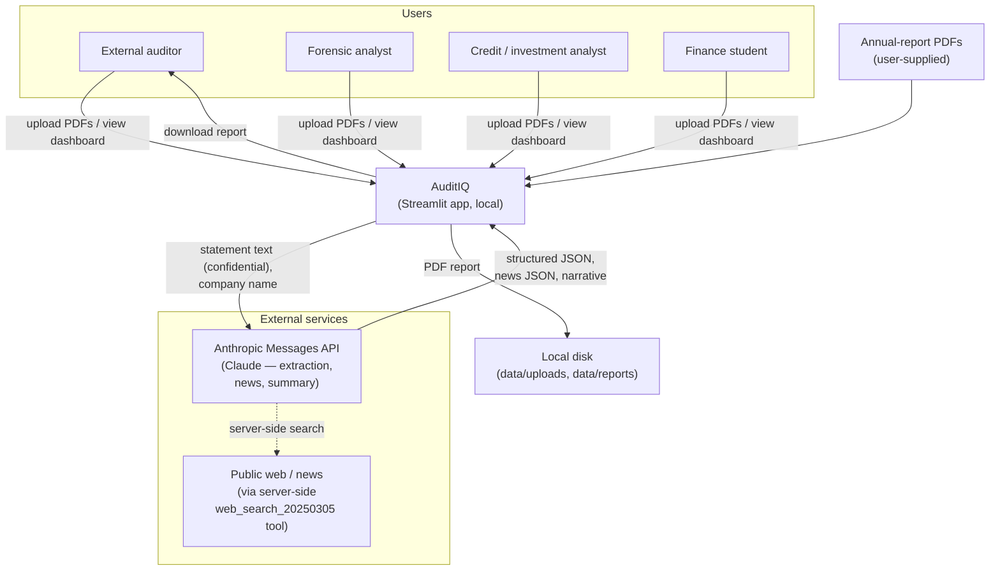
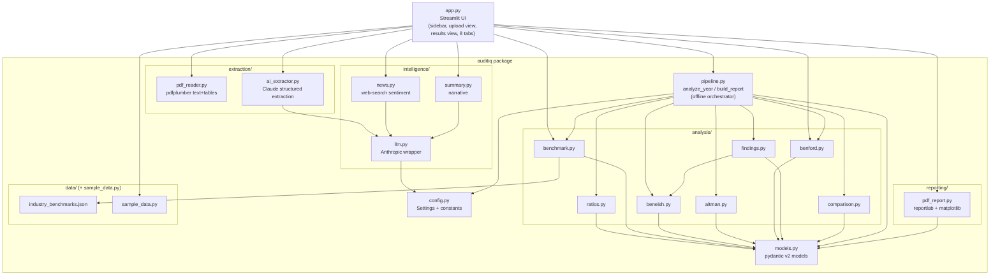
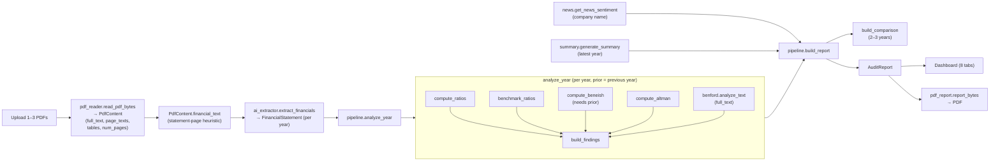
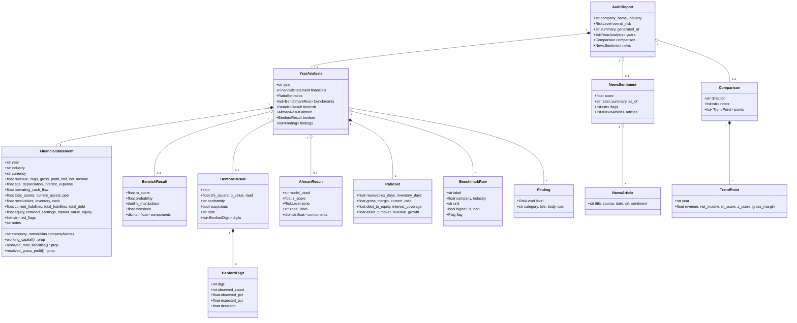

# AuditIQ — Technical Architecture

| | |
|---|---|
| **Product** | AuditIQ — AI-Powered Forensic Audit Intelligence |
| **Version** | Draft v0.1 |
| **Status** | Draft |
| **Date** | 2026-06-25 |
| **Related docs** | [PRD](./PRD.md) · [FUNCTIONAL_SPEC](./FUNCTIONAL_SPEC.md) · [TEST_PLAN](./TEST_PLAN.md) |

---

## 1. Overview & design principles

AuditIQ is a Python 3.12 application with a Streamlit front end and a layered Python package
(`auditiq/`) behind it. The architecture deliberately separates a **deterministic analytical
core** from an **AI layer**.

**Design principles**

1. **Deterministic core, AI at the edges.** All scoring (ratios, Beneish, Benford, Altman,
   benchmarking, findings synthesis, comparison) lives in `auditiq/analysis/` and is pure and
   network-free. The orchestrator `auditiq/pipeline.py` is "intentionally free of network/LLM
   calls so it can be unit-tested offline." AI-derived inputs (extracted financials, news,
   narrative) are produced separately and *passed into* the pipeline.
2. **Graceful degradation.** `config.Settings.has_api_key` gates every AI feature. With no
   key: PDF extraction and news/summary are disabled, the deterministic core still runs, and
   **demo mode** (`auditiq/sample_data.py`) renders a full report offline. AI helpers return
   safe defaults (`None` / `''`) on failure rather than raising.
3. **Typed contracts.** pydantic v2 models in `auditiq/models.py` are the single shared
   vocabulary across extraction, analysis, reporting, and UI. The extraction model accepts
   camelCase aliases so Claude's JSON validates directly.
4. **Single source of truth for constants.** Thresholds, zones, model names, and paths live in
   `auditiq/config.py`.
5. **Branding from a design mockup.** The `prototype/` directory (HTML/JS/CSS) is the design
   source of truth for the AuditIQ brand: dark-navy theme `#0a0f1e`, accent blue `#3b82f6`,
   green `#10b981`, amber `#f59e0b`, red `#ef4444`, fonts IBM Plex Mono + Inter. These values
   are mirrored in `.streamlit/config.toml`, `app.py`, and `reporting/pdf_report.py`.

---

## 2. Diagrams

### 2.1 System context



### 2.2 Component / container diagram



### 2.3 Pipeline data flow



> Note: `news` and `summary` are computed by `app.run_analysis` and attached to the report
> (summary is set onto `report.summary` after `build_report`). The pipeline itself never calls
> the network.

### 2.4 Sequence — analyse uploaded PDFs end-to-end

```mermaid
sequenceDiagram
    actor User
    participant UI as app.py (Streamlit)
    participant PR as pdf_reader
    participant AX as ai_extractor
    participant LLM as intelligence/llm
    participant API as Anthropic API
    participant PIPE as pipeline
    participant NEWS as intelligence/news
    participant SUMM as intelligence/summary

    User->>UI: Upload 1–3 PDFs, click "Run analysis"
    UI->>UI: validate (count 1..3, key present)
    loop for each PDF
        UI->>PR: read_pdf_bytes(bytes)
        PR-->>UI: PdfContent
        UI->>AX: extract_financials(financial_text, year)
        AX->>LLM: complete(prompt, extraction_model)
        LLM->>API: messages.create(...)
        API-->>LLM: JSON text
        LLM-->>AX: text
        AX->>AX: extract_json + model_validate
        AX-->>UI: FinancialStatement
    end
    UI->>NEWS: get_news_sentiment(company)
    NEWS->>LLM: complete(prompt, news_model, tools=[web_search])
    LLM->>API: messages.create(... web_search ...)
    API-->>LLM: JSON text (after search)
    NEWS-->>UI: NewsSentiment | None
    UI->>PIPE: build_report(statements, industry, benford_texts, news)
    PIPE-->>UI: AuditReport (years, comparison, overall_risk)
    UI->>SUMM: generate_summary(latest year, industry)
    SUMM->>LLM: complete(prompt, narrative_model)
    LLM->>API: messages.create(...)
    API-->>SUMM: narrative text
    SUMM-->>UI: summary | ''
    UI->>UI: report.summary = summary; store in session_state
    UI-->>User: results_view (metric cards + 8 tabs)
```

### 2.5 Class diagram — pydantic models



---

## 3. Tech stack & rationale

| Layer | Technology | Rationale |
|-------|-----------|-----------|
| UI / app | **Streamlit** (`>=1.38,<2.0`) | Fast Python-native dashboards; session state; file upload; native widgets. |
| Dashboard charts | **plotly** (`>=5.22,<6.0`) | Interactive bars/gauges/lines with transparent backgrounds matching the dark theme. |
| PDF report charts | **matplotlib** (`>=3.8,<4.0`, `Agg`) | Headless static PNG charts embedded into the PDF. |
| PDF report | **reportlab** (`>=4.1,<5.0`) | Programmatic, branded A4 PDF generation. |
| PDF parsing | **pdfplumber** (`>=0.11,<0.12`) | Text + table extraction from machine-readable PDFs. |
| AI | **anthropic** SDK (`>=0.40,<1.0`) | Claude for extraction, news, narrative; server-side web search tool. |
| Data models | **pydantic v2** (`>=2.8,<3.0`) | Typed validation; camelCase aliases for LLM JSON. |
| Numerics / stats | **scipy** (`>=1.13,<2.0`), **numpy** | Normal CDF (Beneish probit), chi-square (Benford). |
| Data wrangling | **pandas** (`>=2.2,<3.0`) | Benchmark dataframe in the dashboard. |
| Config | **python-dotenv** (`>=1.0,<2.0`) | `.env`-driven settings. |
| Tests | **pytest** (`>=8.2,<9.0`) | Unit tests for the deterministic engines. |

Default model for all three AI roles: **`claude-sonnet-4-6`** (overridable via env).

## 4. External integrations

- **Anthropic Messages API** via `intelligence/llm.py`. `get_client()` lazily constructs and
  caches an `Anthropic` client and raises `LLMError` if no key is set. `complete()` issues a
  single-turn `messages.create` with `temperature=0.0` and bounded `max_tokens`, optionally
  passing `system` and `tools`, and assembles only `text` content blocks.
- **Model selection.** `extraction_model` / `narrative_model` / `news_model` come from
  `config.Settings` (env-overridable; default `claude-sonnet-4-6`).
- **Server-side web search.** `intelligence/news.py` passes
  `{"type": "web_search_20250305", "name": "web_search", "max_uses": 5}` as a tool so Claude
  performs the search itself; the account must have web search enabled.

## 5. Configuration & secrets

- All configuration is centralised in `config.py` via a frozen `Settings` dataclass populated
  from environment variables (loaded from `.env` by `python-dotenv`).

  | Setting | Env var | Default |
  |---------|---------|---------|
  | `anthropic_api_key` | `ANTHROPIC_API_KEY` | `None` |
  | `extraction_model` | `AUDITIQ_EXTRACTION_MODEL` | `claude-sonnet-4-6` |
  | `narrative_model` | `AUDITIQ_NARRATIVE_MODEL` | `claude-sonnet-4-6` |
  | `news_model` | `AUDITIQ_NEWS_MODEL` | `claude-sonnet-4-6` |
  | `max_pdf_pages` | `AUDITIQ_MAX_PDF_PAGES` | `60` |

- `Settings.has_api_key` is the single gate for AI features. `.env.example` documents the keys.
- Streamlit theming and upload size live in `.streamlit/config.toml` (dark theme, brand
  colours, `maxUploadSize = 50`, `headless = true`).

## 6. Data storage

- **Paths** (created on import in `config.py`): `data/` (`DATA_DIR`), `data/uploads`
  (`UPLOAD_DIR`), `data/reports` (`REPORT_DIR`); benchmark dataset at
  `auditiq/data/industry_benchmarks.json` (`BENCHMARKS_PATH`).
- **In-memory state.** The dashboard keeps the active `AuditReport` and selected `industry` in
  `st.session_state`; there is no database.
- **Generated reports.** `generate_report` writes a timestamped PDF into `data/reports`; the
  dashboard's download button builds bytes in memory via `report_bytes`.
- Uploaded PDF bytes are read in-memory (`read_pdf_bytes`); the app does not persist uploads to
  disk in the current flow (the `data/uploads` directory exists for future use).

## 7. Error handling & graceful degradation

- **No key:** `get_client()` raises `LLMError`; callers that are user-facing handle it. News
  returns `None` early when there is no key; summary returns `''`; the Run-analysis button is
  disabled and demo mode is offered.
- **AI failures:** `news.get_news_sentiment` and `summary.generate_summary` wrap calls in
  `try/except` and return `None`/`''`. `extract_json` tolerates code fences and prose and
  falls back to a regex object/array match.
- **Pipeline robustness:** missing financial fields propagate as `None`; engines use safe
  division (`_safe_div`, `_safe`) and return `None` when inputs are insufficient (e.g. Beneish
  with no prior year, Altman with no assets/liabilities/equity).
- **UI:** `upload_view` wraps `run_analysis` in `try/except`, surfacing
  `Analysis failed: {exc}` without clearing session state.

## 8. Performance

- **PDF page cap:** `settings.max_pdf_pages` (60) limits pages scanned per PDF.
- **Token budget:** extraction prompt truncates report text to the first **15,000** chars;
  `max_tokens` is bounded per role (extraction 1500, summary 400, news 2500).
- **Caching:** `load_benchmarks` (`lru_cache(maxsize=1)`) and `get_client`
  (`lru_cache(maxsize=1)`).
- **Headless charts:** matplotlib uses the `Agg` backend; figures are closed after rendering.

## 9. Security & privacy

- **Confidentiality:** uploaded financial PDFs may be sensitive; in upload mode their text is
  transmitted to Anthropic for extraction. Only the **company name** is sent for news. This is
  disclosed in the UI/report; users without consent should use demo mode.
- **Local-only persistence:** reports/uploads stay on the local machine; no third-party
  storage.
- **Secret management:** key is read from environment/`.env`; never logged or written by the
  app.
- **No code execution:** PDFs are parsed for text/tables only.
- **Prompt-injection surface:** PDF and news text flow into prompts; mitigations are strict
  "return only JSON" instructions, tolerant parsing, deterministic downstream scoring, and a
  human-in-the-loop framing. See security tests in [TEST_PLAN](./TEST_PLAN.md).
- **Disclaimer:** "Not a substitute for qualified audit advice" appears on the PDF cover and in
  the methodology/disclaimer section, and in the dashboard.

## 10. Extensibility

- **New sector:** add an entry to `industry_benchmarks.json` (label + 8 metric keys); it
  appears automatically in the sidebar selector (`industries()`), benchmarking, and Altman
  model selection. Add the key to `altman.NON_MANUFACTURING` if it should use the emerging
  variant.
- **New analysis engine:** add a module under `analysis/`, call it from
  `pipeline.analyze_year`, extend `YearAnalysis`, and surface it in a new dashboard tab and a
  `pdf_report` section builder.
- **New AI capability:** add a function in `intelligence/` using `llm.complete` / `extract_json`
  and attach its output to `AuditReport` in `app.run_analysis`.

## 11. Deployment

- **Today:** local execution — `streamlit run app.py` in the `.venv` (Python 3.12), with
  `.env` providing the key. Tests via `.venv/bin/pytest`.
- **Future:** containerise (pin Python 3.12 + `requirements.txt`) and deploy to Streamlit
  Community Cloud or a managed container host; inject secrets via the platform's secret store;
  consider per-session isolation and a data-retention policy for `data/`.

---

## 12. Code map

The per-file reference — every source file, its public API, key behaviours, and how it
connects to the rest of the system — lives in a dedicated document:
**[CODE_MAP.md](./CODE_MAP.md)** (the authoritative source of truth for code facts).

In brief, the codebase is organised in dependency order: a `config`/`models` foundation; an
offline orchestrator (`pipeline.py`) over deterministic `analysis/*` engines (ratios,
benchmark, beneish, benford, altman, findings, comparison); an AI layer (`extraction/*`,
`intelligence/*`) wrapping the Anthropic SDK; a reporting layer (`reporting/pdf_report.py`);
the Streamlit entry point (`app.py`); the benchmark dataset and offline sample data; and the
`tests/` suite (15 tests over the deterministic core). The `prototype/` directory is the
design source of truth and is not executed by the Python app. See
[CODE_MAP.md](./CODE_MAP.md) for the full file-by-file breakdown.

---

## 13. Known architecture-level discrepancies / notes

These were found while grounding the docs against the code (see also
[FUNCTIONAL_SPEC §15](./FUNCTIONAL_SPEC.md)):

1. **`BENEISH_THRESHOLD_5VAR = -2.22` is defined but never used.** Only the 8-variable model
   and its `-1.78` threshold are computed.
2. **Benchmarking covers 6 ratios, not all 8.** `benchmark_ratios` emits Receivables Days,
   Gross Margin, Current Ratio, Debt/Equity, Interest Coverage, Asset Turnover.
   `inventory_days` and `revenue_growth` are computed in `ratios.py` (and the JSON carries
   `inventoryDays`/`revenueGrowth`) but are not benchmarked.
3. **Benford on uploads uses the whole document.** `app.run_analysis` passes
   `content.full_text` (not `financial_text`) as the Benford text, maximising sample size.
4. **`altman.NON_MANUFACTURING` = {retail, technology, financial, healthcare}.** `energy` and
   `manufacturing` are *not* in this set, so an energy company uses the original/private variant
   (by market-value availability), not the emerging variant.
5. **`pipeline.analyze_year` calls `compute_altman` / `compute_beneish` with defaults**
   (`model="auto"`, default threshold); there is no per-call override surfaced in the UI.
